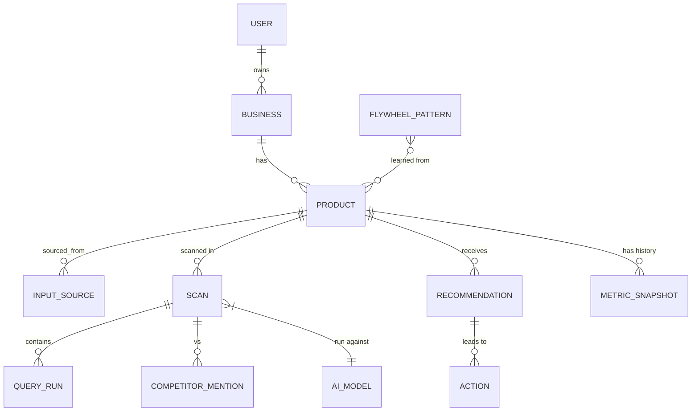
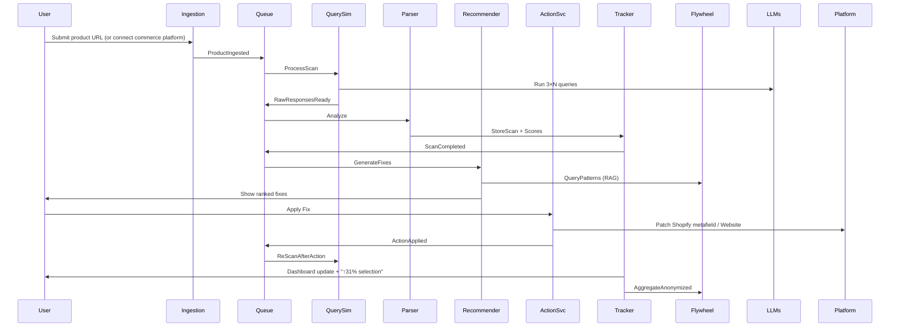

# Amply: System Architecture

Technical reference: services, infrastructure, data model, event flow, phased rollout, and mitigations. Mermaid renders in GitHub, Notion, and many Markdown viewers.

**Implementation status:** MVP slice (ingest + simulate + parse + dashboard) is tracked in [AMPLY_SELECTION_MVP.md](./AMPLY_SELECTION_MVP.md).

---

## High-level architecture

```mermaid
graph TD
    subgraph "Frontend"
        A[Next.js Dashboard\n(React + Tailwind)]
    end

    subgraph "API Gateway"
        B[Node.js/Express or tRPC\n(Auth + Rate Limiting)]
    end

    subgraph "Core Microservices"
        C[Ingestion Service\n(Universal Input Layer)]
        D[Query Simulation Service\n(Async LLM Queries)]
        E[Parsing & Analysis Service\n(Visibility + Selection)]
        F[Recommendation Service\n(Fix Generation & Ranking)]
        G[Action Service\n(Integrations + Instructions)]
        H[Tracking & Metrics Service\n(Scores + Dashboards)]
        I[Data Flywheel Service\n(Aggregated Learning)]
    end

    subgraph "Infrastructure"
        J[(PostgreSQL\n+ pgvector)]
        K[Redis\n(Cache + Rate Limits)]
        L[RabbitMQ\n(Event Bus + Queues)]
        M[S3\n(Snapshots, Logs, Raw AI Responses)]
        N[LLM Providers\n(OpenAI, Anthropic, Google Gemini, Perplexity API)]
        O[External Integrations\n(Shopify, Woo, Stripe, Google Business, etc.)]
    end

    A --> B
    B --> C
    C --> L
    L --> D
    D --> N
    D --> M
    L --> E
    E --> J
    L --> F
    F --> L
    L --> G
    G --> O
    L --> H
    H --> J
    L --> I
    I --> J
    J <--> K
    subgraph "Observability"
        P[Prometheus + Grafana\n+ Sentry + OpenTelemetry]
    end
    C --> P
    D --> P
    E --> P
    F --> P
    G --> P
    H --> P
    I --> P
```

---

## Service / component descriptions

### 1. Ingestion Service

- Accepts URLs (scraping via Puppeteer/Playwright + LLM extraction), Shopify/Woo/BigCommerce OAuth + API webhooks, SaaS APIs (Stripe, Zapier), Google Business Profile, manual JSON/CSV.
- Normalizes everything into a canonical `Product/Service` schema using LLM (structured output mode) + JSON Schema validation.
- Emits `ProductIngested` event, which triggers initial scan.
- Caches raw HTML/JSON in S3 for auditability.

### 2. Query Simulation Service

- Uses a library of domain-specific query templates (e.g., “best [niche] for [use-case] under $X”) + LLM to generate 20 to 50 realistic variants per scan.
- Runs N=3 to 5 parallel queries per model (to handle non-determinism).
- Models supported: GPT-4o, Claude-3.5, Gemini-1.5-Pro, Perplexity Sonar.
- Queued via BullMQ/RabbitMQ; cost-optimized with response caching (Redis hash of query+model+hash(product attributes)).
- Stores raw responses + metadata in S3 (parquet for later analysis).

### 3. Parsing & Analysis Service

- LLM-powered parser (structured outputs + few-shot examples) extracts: mentioned entities, ranking position, explicit selection, reasoning snippets.
- Computes two probabilistic scores (0 to 100):
  - **Visibility Score** = (mentions / total runs) × position_weight
  - **Selection Score** = (chosen / total runs) × confidence
- Competitor discovery: extracts any other named entities and stores them.
- Emits `ScanCompleted` event.

### 4. Recommendation Service

- Takes current product attributes + competitor gaps + historical flywheel patterns.
- Hybrid approach:
  - Prompt-based LLM (Claude-3.5 for reasoning) to generate 5 to 10 fixes with expected impact % (description rewrite, new attribute, pricing change, trust signal, schema markup, etc.).
  - Ranking via lightweight scoring model (logistic regression on historical flywheel data) or simple LLM ranker.
- Stores recommendations with confidence and estimated ROI.

### 5. Action Service

- For supported platforms: Shopify metafields API, Woo REST, website via GitHub/Webflow/Zapier, landing pages via Framer/Webflow API.
- One-click “Apply” starts a background job that patches descriptions, adds JSON-LD, updates pricing, adds reviews widget, etc.
- For unsupported: generates copy-paste instructions + diff preview.
- Emits `ActionApplied` event, which triggers re-scan after cooldown.

### 6. Tracking & Metrics Service

- Time-series storage in Postgres (or TimescaleDB extension).
- Dashboard: visibility/selection trend charts, before/after A/B per action, competitor benchmark.
- Alerts: “Your visibility dropped 18% after competitor update” (via cron + email/Slack).

### 7. Data Flywheel / Learning Engine

- Anonymized aggregation pipeline (daily job):
  - Embeds successful attributes/descriptions (pgvector).
  - Learns patterns (“Adding ‘free shipping’ increased selection +42% for e-comm < $50”).
- Used by Recommendation Service as RAG context + fine-tuning dataset (exportable for future self-hosted model).
- Privacy: zero PII, opt-in only, GDPR-compliant deletion.

---

## Tech stack (production-ready, small-team deployable)

| Area | Choices |
|------|---------|
| **Orchestration** | Docker Compose to Kubernetes (EKS/GKE) or Railway/Fly.io for MVP |
| **Auth** | Clerk or Supabase Auth |
| **Background jobs** | BullMQ + Redis (or Temporal.io for complex workflows in v2) |
| **LLM orchestration** | LangChain.js or LlamaIndex (TypeScript) for structured outputs, retries, cost tracking |
| **Monitoring** | OpenTelemetry to Prometheus/Grafana + Sentry + structured logs |
| **CI/CD** | GitHub Actions + Terraform |

---

## Data model & relationships (PostgreSQL + pgvector)



### Key tables (simplified)

| Table | Notes |
|-------|--------|
| `products` | id, business_id, canonical_jsonb, embeddings `vector(1536)` |
| `scans` | id, product_id, timestamp, visibility_score, selection_score |
| `query_runs` | scan_id, model, query_text, raw_response_s3, parsed_jsonb |
| `recommendations` | id, product_id, fix_type, description, expected_impact, status |
| `actions` | recommendation_id, applied_at, platform, change_diff |
| `flywheel_patterns` | pattern_id, attribute_key, lift_percentage, confidence, count |

---

## Event flow (query, output, fix, tracking)



---

## MVP vs scalable plan

### MVP (8 to 10 weeks, 2 engineers)

- Inputs: product URL (MVP); Shopify, Woo, and similar connectors in later phases
- 2 AI models (GPT-4o + Claude)
- Visibility + Selection scoring
- LLM-generated fixes (manual apply)
- Basic dashboard (Vercel + Next.js)
- Postgres + Redis + BullMQ + S3
- Cost: ~$0.30 to $0.80 per full scan (3 runs × 30 queries)

### Phase 2 (full system, +8 weeks)

- Universal inputs + webhooks
- All 4 AI models + Perplexity
- Automated apply (Webflow, Woo, Google Business)
- Data flywheel + RAG patterns
- Competitor benchmarking
- Alerts + API for agencies
- Self-hosted embedding model option

### Phase 3 (enterprise)

- On-prem / VPC deployment
- Custom fine-tuned model
- White-label for agencies
- Real-time webhooks from AI providers (future)

---

## Key challenges & mitigations

| Challenge | Mitigation |
|-----------|------------|
| Non-determinism | Statistical aggregation + confidence intervals in UI |
| LLM cost | Aggressive caching + query deduplication + cheaper-model fallbacks |
| Attribution | A/B-style re-scans post-action with control group |
| Privacy | Cross-business data anonymized + encrypted at rest; users own scan history |
| Scaling | Horizontal pods + queue back-pressure; target 10k scans/month, design for 1M+ |

---

## Positioning note

This architecture is deliberately **modular**, **event-driven**, and **LLM-orchestrated** so a small team can ship the MVP in one sprint cycle and iterate the flywheel into a competitive moat. Amply aims to be **“SEO for the AI era”**: where the “algorithm” is the frontier model ecosystem.
